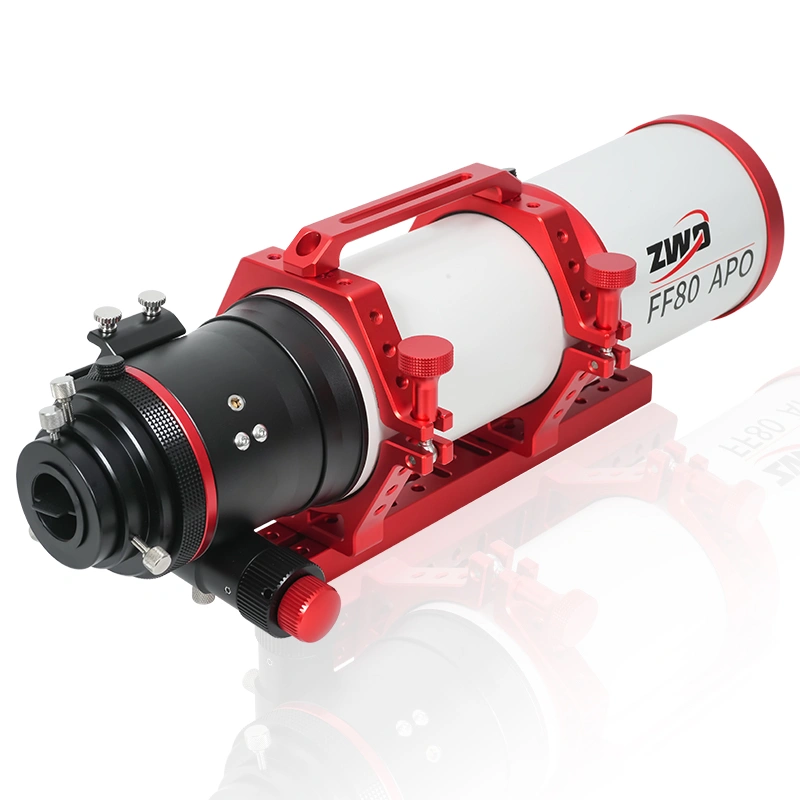
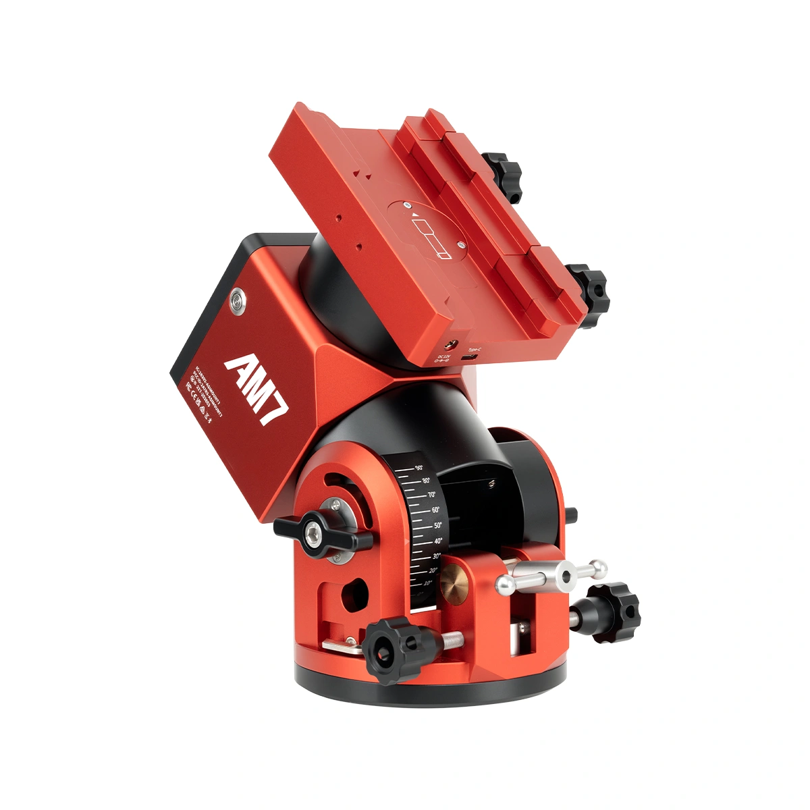
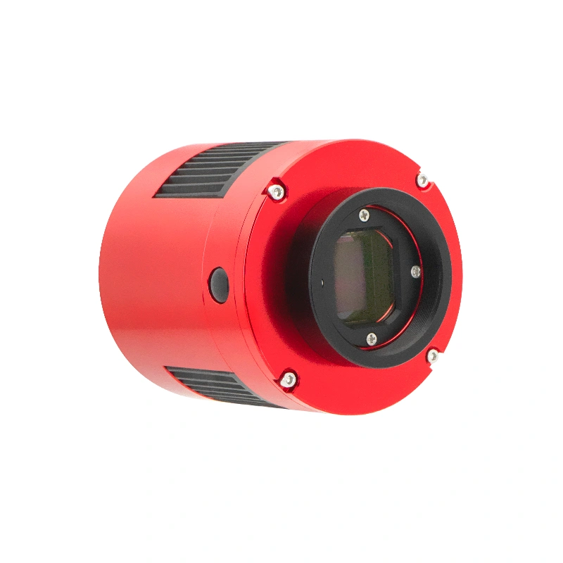
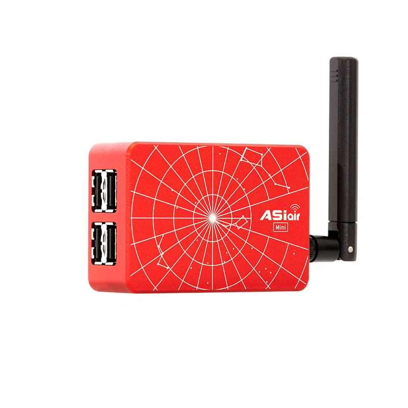
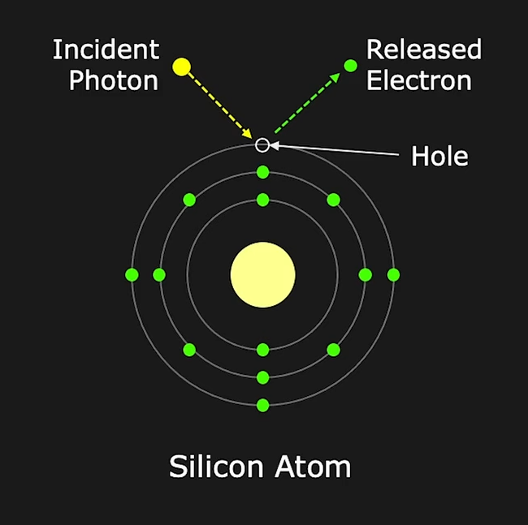
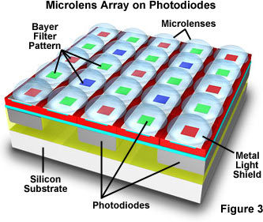
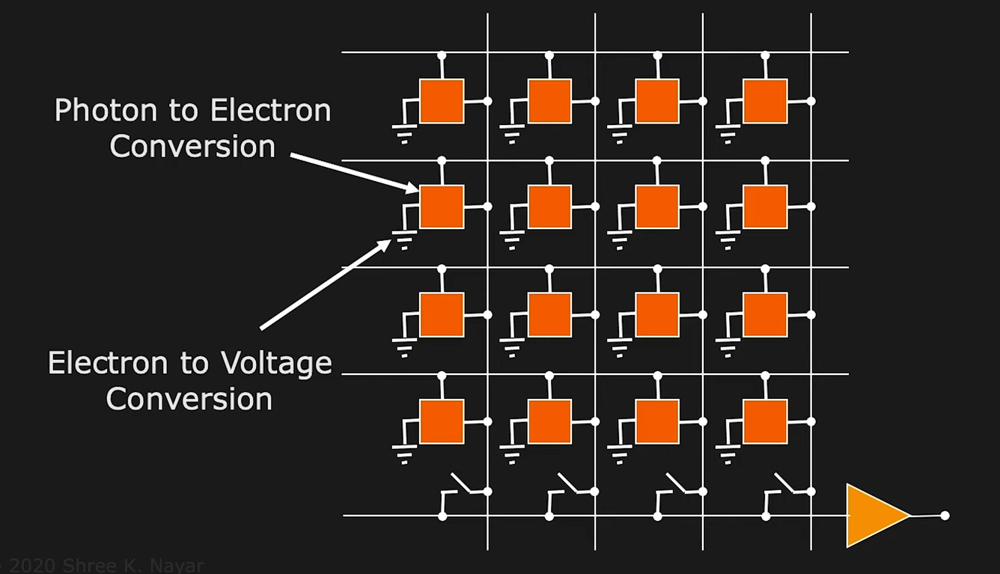
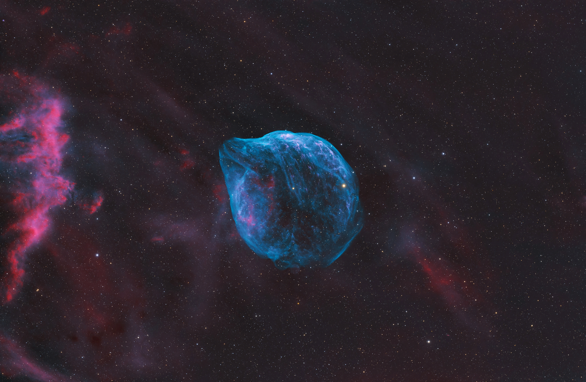
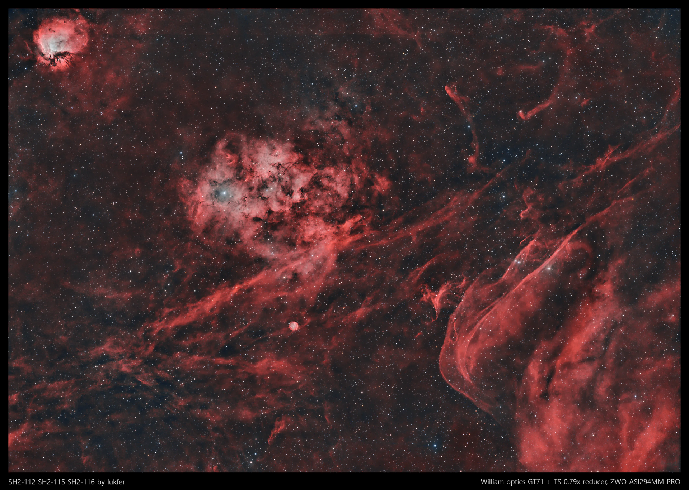
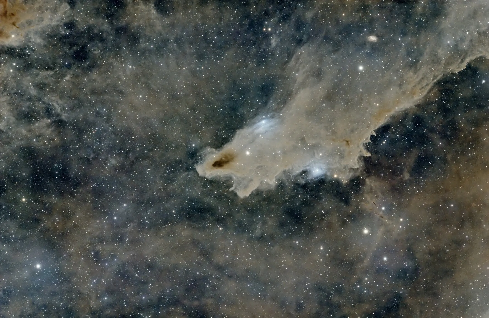

<!-- column_layout: [1, 3] -->

<!--column: 0-->

# ZWO Astro

A specialized manufacturer of amateur stargazing and astrophotography gear.

<!--column: 1-->

> FF80 APO Telescope. Source: https://www.zwoastro.com/

---

<!-- column_layout: [1, 3] -->

<!--column: 0-->

# ZWO Astro

A specialized manufacturer of amateur stargazing and astrophotography gear.

<!--column: 1-->

> AM7 Harmonic Equatorial Mount. Source: https://www.zwoastro.com/

---

<!-- column_layout: [1, 3] -->

<!--column: 0-->

# ZWO Astro

A specialized manufacturer of amateur stargazing and astrophotography gear.

<!--column: 1-->

> ASI294 Pro Series Digital Camera. Source: https://www.zwoastro.com/

---

<!-- column_layout: [1, 3] -->

<!--column: 0-->

# ZWO Astro

A specialized manufacturer of amateur stargazing and astrophotography gear.

<!--column: 1-->

> ASIAIR Mini Wireless Controller. Source: https://www.zwoastro.com/

---

## Some assembly required.

> Setup of an astrophotography rig. Source:
> https://www.youtube.com/watch?v=XZyhJctKs0Y

---

## _All we ever see from the stars... are their old photographs._

<!--column_layout: [3, 1]-->

<!--column: 0-->

<!--column: 1-->

### Photographer

沉浸

### Camera used

ZWO ASI2600MM Pro

### Source

https://www.astroimg.com/thread/367043

<!--speaker_note: Astrophotography is an endeavor that requires extreme precision, in order to
capture faint light sources over an extended period of time, usually across many
hours.-->

---

<!--column_layout: [2, 1] -->

<!--column: 0-->

> Source: https://upload.wikimedia.org/wikipedia/commons/4/42/Matrixw.jpg

<!--column: 1-->

# CMOS Image Sensors

<!--pause-->

- Stands for "_Complementary Metal Oxide Semiconductor_"

<!--pause-->

- The technology behind modern day consumer digital cameras, from smartphones
  to, in this case, telescopes

---

## Probably the briefest introduction to CMOS known to man

<!--column_layout: [2, 1]-->

<!--column: 0-->

> Source: https://www.youtube.com/watch?v=nsPvcX-_4KU

<!-- column: 1-->

### Physical principle

Like the `CCD Image Sensor` that preceded it, it is a machine that converts
luminous energy into electric charges that are fed into a circuit.

---

## Probably the briefest introduction to CMOS known to man

<!--column_layout: [2, 1]-->

<!--column: 0-->

<!--column: 1-->

### The capture of light

For each pixel, a matrix of "wells" captures the light through colored filters
and microlenses.

---

## Probably the briefest introduction to CMOS known to man

<!--column_layout: [2, 1]-->

<!--column: 0-->

> Source: https://www.youtube.com/watch?v=nsPvcX-_4KU

<!--column: 1-->

### Analog to digital circuitry

A dedicated circuit for every pixel, each executing the following operations:

<!--pause-->

- Light to charge conversion, and charge accumulation

<!--pause-->

- Charge transfer and voltage conversion

<!--pause-->

- Amplification

---

# Scientia Vinces: _Through science you'll conquer_ (awesome images)

> Source: https://www.astroimg.com/thread/326320

---

# Scientia Vinces: _Through science you'll conquer_ (awesome images)

> Source: https://www.astroimg.com/thread/361674

---

# Mulțumesc mult

> Source: https://www.astroimg.com/thread/378350
